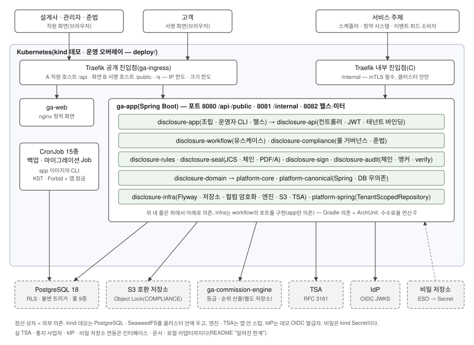

# ga-disclosure

대형 GA(소속 설계사 500인 이상) 설계사가 계약 체결 전에 **동종·유사상품 비교표 → 판매수수료 등급·순위 표기 → 추천사유 → 고객·설계사·관리자 확인(서명) → 불변 보관·감사**를 한 흐름으로 끝내는 멀티테넌트 워크플로 서비스다. 등급·순위의 산출은 별도 저장소 `ga-commission-engine`이 하고, 이 저장소는 그 결과를 스냅샷으로 받아 검증·표시·보관만 한다. 봉인된 확인서는 불변이고 서명은 문서 해시에 귀속되며, 모든 증거는 독립 검증 명령으로 다시 확인할 수 있다.

**규제 배경**: 2026-07-01부터 대형 GA는 계약 체결 과정에서 유사 보험상품의 판매수수료 등급(5단계)·순위(1순위가 가장 저렴)와 추천 사유 등을 추가로 설명해야 한다 — [금융위원회 보도자료(2026-06-30)](https://fsc.go.kr/no010101/87217), 근거 [「보험업감독규정」](https://www.law.go.kr/행정규칙/보험업감독규정)(2026-01-14 금융위 의결 개정).

> **면책** — 학습·포트폴리오 목적 저장소다. 규제 내용은 공개 자료 기반의 예시적 정리이고, 실제 기준은 「보험업감독규정」·시행세칙·협회 표준서식·유권해석 원문을 따른다. 번호 체계·기한·보존기간 등 수치는 가상의 예시값이다. 이 시스템은 "법령 요건 충족"을 단언하지 않는다.

## 알려진 한계·미결정

- **협회 표준확인서 원문 미확보**(§14 #2) — 서식 라벨은 일반 한국어 라벨이고 어디에도 "협회 표준"이라고 표기하지 않는다.
- **징구율에 규제 정의가 없다**(§14 #17) — 화면·보고서의 징구율은 내부 지표(산식은 룰의 닫힌 목록)다.
- **실 TSA·통지 사업자·IdP·비밀 저장소와 연동하지 않았다** — 인터페이스·운영 문서·로컬 어댑터(스텁 TSA·콘솔 통지·데모 OIDC·파일/kind 비밀)까지다. 실 TSA 응답 형태는 opt-in 계약 시험만 있다.
- **mTLS 주체 전달 형식이 비어 있다**(§14 #23) — 운영 오버레이 그대로면 게이트·계약 연결의 인증서 주체 대조 경로가 404다(kind 데모는 대조가 꺼진 데모 프로파일).
- **공개 서명 한도는 복제본마다 센다** — 실효 한도 = 룰 값 × 앱 복제본 수, IP 한도 = 30 × 진입점 복제본 수([`ingress.md`](docs/operations/ingress.md)).
- **공개 서명 응답 하한(패딩)은 설정값**이고 규모에 따른 적정값은 측정하지 않았다.
- 정정의 행위자·재배정(§14 #20), 중복 가명 병합(#22) 등 미결정 23항목의 최종 상태는 [설계서 §14](docs/설계서.md#14-미결정-사항-구현-전-확인-전부-파라미터어댑터로-흡수) 맨 앞 표.

## 숫자 (CI 출처)

| Phase | 내용 | 테스트(CI, 실패·스킵 0) | 규칙 위반 주입 | E2E | CI run |
|---|---|---:|---:|---:|---|
| 0 | 골격·플랫폼 공유 | 4,869 | 표 7행 + 서술 3절 | — | [36549053160](https://github.com/hjryoo-ai/ga-disclosure/actions/runs/36549053160) |
| 1 | 룰·서식 데이터 | 7,138 | 7행(풀면 10) | — | [36554847957](https://github.com/hjryoo-ai/ga-disclosure/actions/runs/36554847957) |
| 2 | 카탈로그·고객 참조·컬럼 암호화 | 7,281 | 12 | — | [36701264864](https://github.com/hjryoo-ai/ga-disclosure/actions/runs/36701264864) |
| 3A | 워크플로 코어·엔진 스냅샷 | 9,268 | 11 | — | [36712325175](https://github.com/hjryoo-ai/ga-disclosure/actions/runs/36712325175) |
| 3B | 봉인·PDF/A·저장소 Object Lock | 10,790 | 22 | — | [36856909677](https://github.com/hjryoo-ai/ga-disclosure/actions/runs/36856909677) |
| 4 | 서명·증거 패키지 | 11,733 | 56 | — | [37063019897](https://github.com/hjryoo-ai/ga-disclosure/actions/runs/37063019897) |
| 5 | 앵커·TSA·검증·파기 | 12,037 | 69 | — | [37099922622](https://github.com/hjryoo-ai/ga-disclosure/actions/runs/37099922622) |
| 6A | REST API·작업·멱등 | 12,204 | 105 | — | [37786410851](https://github.com/hjryoo-ai/ga-disclosure/actions/runs/37786410851) |
| 6B | 준법 큐·계약 연결·게이트 | 13,642 | 151 | — | [37926046428](https://github.com/hjryoo-ai/ga-disclosure/actions/runs/37926046428) |
| 7 | 화면·E2E | 13,689 + 화면 단위 24 | 27(보고서; W3a·b를 둘로 세면 28) | 12 | [37968091134](https://github.com/hjryoo-ai/ga-disclosure/actions/runs/37968091134) |
| 8 | 배포·운영·키 회전·백업·복구 | Phase 8 PR의 CI 뒤 기입 | | | |

테스트 수는 각 run의 `test-reports` 아티팩트(Gradle 보고서 합계)와 대조했다. 주입은 규칙 시험(ArchUnit·SQL 스캔·트리거·린트)마다 일부러 위반을 넣어 실패를 확인하고 되돌린 기록이다 — 수는 각 Phase 보고서의 주입 표에서 센다(CI 아티팩트에는 없다).

## 아키텍처



규칙이 코드의 어디서 강제되는지(그리고 강제되지 않는 곳)는 [`docs/ARCHITECTURE.md`](docs/ARCHITECTURE.md), 확인서 하나의 증거 수명주기는 [`docs/EVIDENCE.md`](docs/EVIDENCE.md), 되돌리거나 틀렸던 결정은 [`docs/DECISIONS.md`](docs/DECISIONS.md).

## 15분 둘러보기 (kind)

빈 kind 클러스터에 배포 → 데모 데이터 → 화면 → `verify tenant`. 사용자 환경의 다른 것(compose 볼륨·다른 클러스터)은 건드리지 않고, 끝나면 `down`이 이 클러스터와 그 비밀 디렉터리만 지운다.

**필요한 것**: Docker(메모리 8GB 안팎), JDK 17 이상(Gradle 실행용 — Java 25 툴체인과 화면 빌드용 Node는 Gradle이 받는다), `curl`·`jq`·`openssl`(LibreSSL도 된다), 화면을 볼 때 Chrome. kind·kubectl·kubeconform은 `deploy/tools.lock`의 고정판을 Gradle이 `build/tools`에 받는다(전역 설치 없음). macOS·Linux. 저장소 루트에서 실행한다.

**시간**: 캐시가 찬 기계에서 아래 명령 전체가 약 6.4분이었다(2026-10-10 재현 — 아래 "재현 기록"). 첫 실행은 Java 툴체인·의존성·노드 이미지·이미지 빌드를 받느라 더 걸린다(측정하지 않았다).

```bash
git clone https://github.com/hjryoo-ai/ga-disclosure && cd ga-disclosure
C=ga-tour-$(date +%s)                 # 클러스터 이름(ga-로 시작)
deploy/scripts/kind.sh up "$C"        # 도구 받기 · 클러스터 · 이미지 빌드·적재(첫 실행은 빌드 때문에 오래 걸린다)
deploy/scripts/kind.sh deploy "$C"    # 비밀 생성(저장소 밖 ~/.ga-disclosure/kind/$C) → 적용 → 마이그레이션 Job → 롤아웃
deploy/scripts/kind.sh smoke "$C"     # 진입점 셋·mTLS·한도·NetworkPolicy 단언(실패 0이어야 한다)
deploy/scripts/kind.sh seed "$C"      # 데모 테넌트 셋 시드 → 클러스터 안 VERIFY_TENANT: DEMO1·DEMO2·DEMO3 MATCH
deploy/scripts/kind.sh browse "$C"    # 화면을 볼 Chrome 명령줄을 출력 — 복사해 실행(별도 프로필, hosts·신뢰 저장소 변경 없음)
deploy/scripts/kind.sh verify "$C"    # 화면에서 무엇을 했든 다시: 모든 테넌트 MATCH가 아니면 종료 1
deploy/scripts/kind.sh down "$C"      # 클러스터와 ~/.ga-disclosure/kind/$C만 지운다 — 이미지(ga-disclosure/*:dev·kindest/node)·Docker 네트워크 kind·클론의 build/는 남는다
```

`VERIFY_TENANT … MATCH findings=0 sha256=…`의 해시는 그 실행의 검증 **보고서**(실행 시각 포함)의 해시라 실행마다 다르다 — 같아야 하는 것은 `MATCH findings=0`이다.

**화면**(직원 호스트 `https://staff.ga.example.invalid:18443/staff`): "데모 로그인" → 새 창에서 계정 선택(팝업 허용 필요). 역할은 토큰이 아니라 서버의 `identity_link`에서 온다.

| 계정 | 역할 | 해 볼 것 |
|---|---|---|
| `DEMO1 · demo-agent` | 설계사 | 새 확인서 → 비교 상품 → 등급·순위 → 추천사유(룰 어휘에서 고르고 설명은 직접) → 검증 → 봉인 → 서명 세션 "현장 터치패드" → 서명 호스트의 서명 창 |
| `DEMO1 · demo-manager` | 관리자 | 목록 → 상세의 플래그 확인 → 관리자 확인(마지막 서명이면 완료) |
| `DEMO1 · demo-compliance` | 준법 | 준법 플래그(필터·배정·해소)·법적 보존(해제는 `demo-compliance-2` — 4-eyes)·작업(보존 재계산 dry-run)·징구율 |

같은 흐름과 `CHAIN_BROKEN` 해소(감사 행 하나를 잠깐 바꿔 검증이 찾게 한 사건)는 `./gradlew :disclosure-web:e2eKind -Pkind.cluster="$C"`가(준비 `kind.sh e2e-prep`은 이 작업이 스스로 부르고, 처음이면 Playwright Chromium을 받는다. 끝의 `E2E DOWN`은 시험 프로세스만 정리하고 클러스터는 남긴다) 진입점 A·B·C로 데스크톱·모바일 12건을 돈다(CI 잡 `kind`는 여기에 백업·복구·키 회전 여섯 종을 더 돈다 — [`docs/operations/`](docs/operations/)).

### 재현 기록

| 누가 | 언제 | 무엇을 보고 | 결과·막힌 곳 |
|---|---|---|---|
| 맥락 없는 별도 에이전트(이 작업의 맥락을 받지 않은 새 세션) | 2026-10-10 | `work/phase-8` `9549c9d`의 새 클론 + 이 README만 | **세 테넌트 MATCH까지 막힘 없음.** up 63초 · deploy 126초 · smoke 20초(실패 0) · seed 165초(`SEED_LINES 44`) · verify 11초 · down 1초(웜 캐시, macOS arm64 · Docker 7.75GiB). 화면은 헤드리스 Chrome으로 직원 페이지 로드(TLS 오류 0)까지만 — 로그인 이후는 사람 몫, 대신 e2eKind 12/12. 추측한 곳 6개(e2e-prep 순서, 실행마다 바뀌는 VERIFY 해시, 첫 실행 시간, down이 남기는 것, Node, 클론·cd 줄)는 이 판에서 README에 반영했다 |
| 사람 | — | — | 수용 심사와 별개로 편한 때(PR 코멘트 + 이 표) |

## 문서 색인

| 문서 | 내용 |
|---|---|
| [`docs/설계서.md`](docs/설계서.md) | 설계 정본 — 대전제(§0), 데이터 모델, 상태기계, API, 보안, §14 미결정 |
| [`CLAUDE.md`](CLAUDE.md) | 작업 규칙(절대 규칙 9개 — 이 저장소는 사람의 심사와 에이전트의 구현으로 Phase 단위로 만들었다) |
| `docs/phase-NN-{지시문,계획,계획승인,보고서,수용심사}.md` | Phase 0~8의 지시 → 계획 → 승인 → 보고 → 심사 |
| [`docs/ARCHITECTURE.md`](docs/ARCHITECTURE.md) · [`docs/EVIDENCE.md`](docs/EVIDENCE.md) · [`docs/DECISIONS.md`](docs/DECISIONS.md) | 규칙 강제 지점 · 증거 수명주기 · 결정 기록 |
| [`docs/operations/`](docs/operations/) | 배포 · 예약 작업 · 진입점·한도·브라우저 전제 · 키 회전 · 백업·복구 · 테넌트 온보딩 |
| [`docs/DEVELOPMENT.md`](docs/DEVELOPMENT.md) | 로컬 개발 실행 · 운영자 CLI 참조 · 모듈 표 · Phase별 기능 설명 · 플랫폼 아티팩트 소비 |
| [`docs/db-error-codes.md`](docs/db-error-codes.md) · [`docs/event-feed.md`](docs/event-feed.md) · [`docs/third-party.md`](docs/third-party.md) | DB 오류 코드(GDxxx) · 이벤트 피드 · 제3자 라이선스 |
